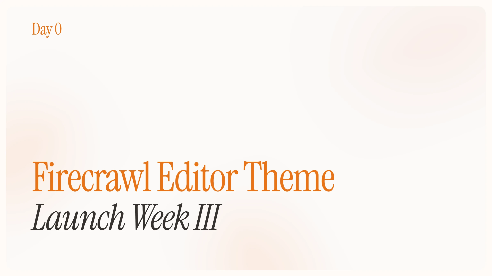

## Day 0 - Firecrawl Editor Theme

We're excited to release our official Firecrawl Editor Theme! Available now for most editors including Cursor, Windsurf, and more.

### Download
You can download the editor theme on the VS Code Marketplace [here](https://firecrawl.link/lw3-editor-theme).

### Features
The Firecrawl Editor Theme provides a clean, focused coding experience with syntax highlighting optimized for web scraping and crawling tasks. Our color palette emphasizes readability while maintaining the Firecrawl brand identity.